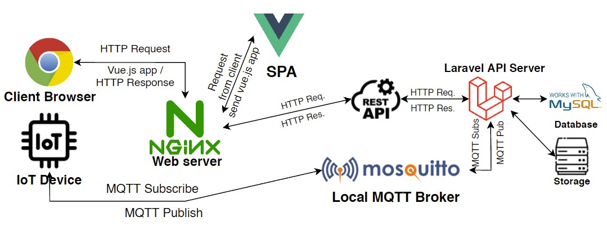
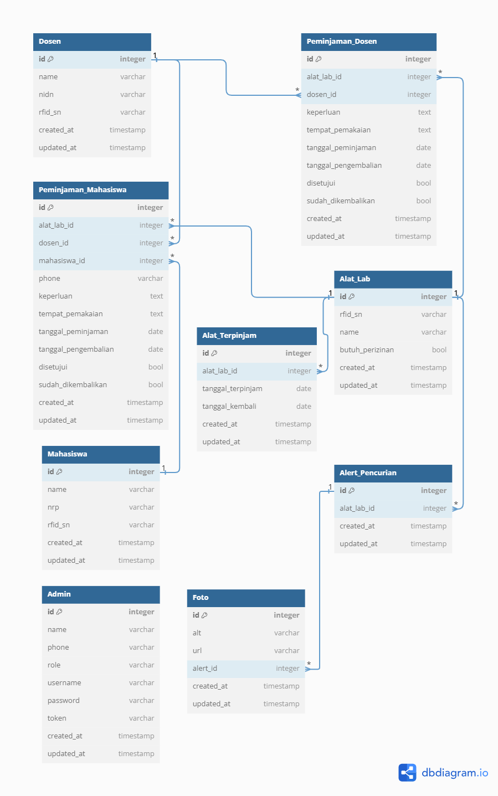
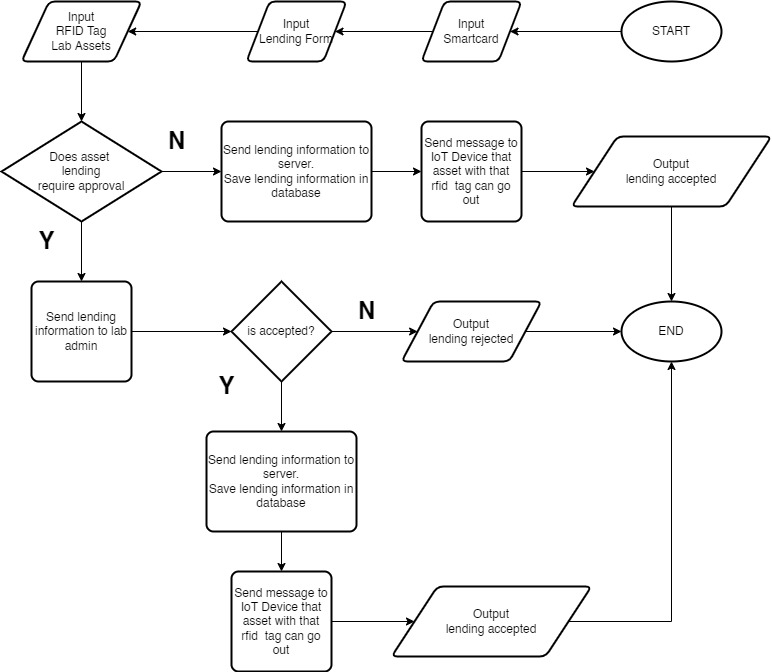
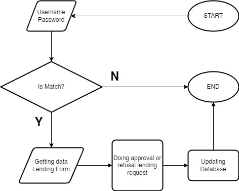
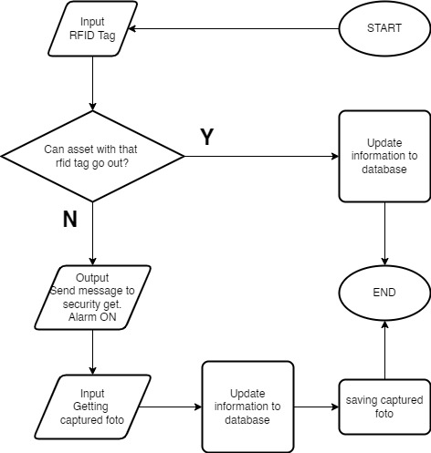

## Project is on progress (Unfinished Yet)

# Overview

## Architecture System

## Database Design

#### Dosen
**Columns**: id, name, nidn, rfid_sn, created_at, updated_at.

**Description**: This table stores information about lecturers. Each lecturer has a unique ID, name, NIDN, RFID serial number, and information about the creation and update time of the data.

#### Peminjaman_Dosen
**Columns**: id, alat_lab_id, dosen_id, keperluan, tempat_pemakaian, tanggal_peminjaman, tanggal_pengembalian, disetujui, sudah_dikembalikan, created_at, updated_at.

**Description**: This table records information about equipment loans by lecturers. It has a relation with the Alat_Lab table through alat_lab_id and with the Dosen table through dosen_id.

#### Peminjaman_Mahasiswa
**Columns**: id, alat_lab_id, dosen_id, mahasiswa_id, phone, keperluan, tempat_pemakaian, tanggal_peminjaman, tanggal_pengembalian, disetujui, sudah_dikembalikan, created_at, updated_at.

**Description**: This table records information about equipment loans by students. It has a relation with the Alat_Lab table through alat_lab_id, with the Dosen table through dosen_id, and with the Mahasiswa table through mahasiswa_id.

#### Alat_Lab
**Columns**: id, rfid_sn, name, butuh_perizinan, created_at, updated_at.

**Description**: This table stores information about laboratory equipment. It has relations with the Peminjaman_Dosen and Peminjaman_Mahasiswa tables through id.

#### Alat_Terpinjam
**Columns**: id, alat_lab_id, tanggal_terpinjam, tanggal_kembali, created_at, updated_at.

**Description**: This table records information about borrowed equipment. It has a relation with the Alat_Lab table through alat_lab_id.

#### Mahasiswa
**Columns**: id, name, nrp, rfid_sn, created_at, updated_at.

**Description**: This table stores information about students. Each student has a unique ID, name, NRP, RFID serial number, and information about the creation and update time of the data.

#### Admin
**Columns**: id, name, phone, role, username, password, token, created_at, updated_at.

**Description**: This table stores information about admins who manage the system.

#### Alert_Pencurian
**Columns**: id, alat_lab_id, created_at, updated_at.

**Description**: This table records information about equipment theft incidents. It has a relation with the Alat_Lab table through alat_lab_id.

#### Foto
**Columns**: id, alt, url, alert_id, created_at, updated_at.

**Description**: This table stores photos related to theft alerts. It has a relation with the Alert_Pencurian table through alert_id.

## System WorkFlow
### Lending

### Admin Approval

### Security Gate System

